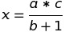

# Funkcje

### Teoria

##### Czym jest funkcja?

Funkcja jest fragmentem kodu, który może być wykrzystywany wielokrotnie, w różnych miejscach kodu. Pozwala ona na wydzielenie kodu, implementującego konkretną funkcjonalność.

Deklaracja funkcji sklada sie z trzech części:

- Typu - określenie zwracanych wartości (np. void, int, double, string),
- Nazwa - czyli po prostu to, jak mamy się do tego odnosić,
- Argumenty - dodatkowe zmienne, które są potrzebne do wykonania kodu funkcji.

Przykładem funkcji, którą już znacie jest:

```
void main(int argc, char** argv)
```

Sami też możemy dodać własne funkcje poza kodem **main**:

```
void PrzykladowaFunkcja(int liczba)
{
  cout<<"Do funkcji przekazano wartosc: "<<liczba<<endl;
}
```

Aby wykorzystać naszą funkcję **PrzykladowaFunkcja**, należy odwołać się do niej w kodzie (np. w main):

```
PrzykladowaFunkcja(3);
```

##### Zwracanie wartości

Głównym celem funkcji, jest zwrócenie danych, w zależności od tego co otrzymaliśmy w argumentach, służy do tego słowo kluczowe **return**.

```
int Dodaj(int a, int b)
{
  return a + b;
}
```

Możemy także dodać wartości domyślne w ten sposób:

```
int Dodaj(int a, int b = 0)
{
  return a + b;
}
```

##### Funkcja inline

Przydatne dla małych funkcji. Polega na tym, że funkcja nie jest wywoływana, ale jej zawartość jest "wklejana" w określone miejsce, przez co skracany jest czas wywoływania kodu.

```
inline int Dodaj(int a, int b)
{
  return a + b;
}
```

##### Przeładowanie funkcji

Można przeładowywać funkcje, nadając im więcej znaczeń. Można w ten sposób zadeklarować i wykorzystać kilka funkcji o tej samej nazwie, zmieniając ich typ, ilość argumentów, czy chociażby to co dzieje się między klamerkami.

```
int dodaj (int a, int b)
{
  return a + b;
}

double dodaj (double a, double b)
{
  return a + b;
}
```

### Zadania

**Wszystkie zmienne do funkcji, powinny być podane przez użytkownika aplikacji.**

1. Napisz funkcję, która będzie obliczać następujący wzór matematyczny:

   

2. Napisz funkcję, która sprawdza czy podana liczba jest nie-/parzysta,
3. Napisz funkcję, która sprawdzi czy liczba jest dodatnia czy ujemna,
4. Napisz funkcję, która zamieni stopnie Celciusza na Fahrenheita,
5. Napisz funkcję, która odpowie czy podana liczba, jest liczbą pierwszą,
6. Napisz prosty kalkulator, który będzie posiadał następujące działania:

   - Dodawanie,
   - Odejmowanie,
   - Mnożenie,
   - Dzielenie (nie zezwalaj na dzielenie przez 0),
   - Ułamek (sprawdź w internecie jak tego dokonać).
