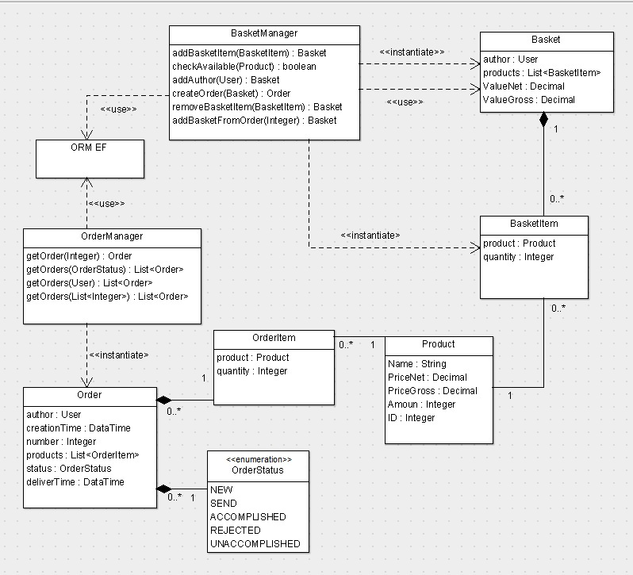

# Wprowadzenie do programowania obiektowego

## Teoria

Na poprzednich zajęciach przypomniane zostało jak zbudowane są klasy i obiekty. Wiedza z poprzednich zajęć jest wymagana na dzisiejszych ćwiczeniach.

**Interface** - Informują one że pewna grupa klas implementuje pewne metody, właściwości, zdarzenia oraz indeksery, ale nic więcej. Nie można w nich na przykład umieszczać deklaracji zmiennych ani konstruktorów. Implementacja metod i innych elementów interfejsu zależy wyłącznie od obiektu.

**Dziedziczenie** - mechanizm współdzielenia funkcjonalności między klasami. Klasa może dziedziczyć po innej klasie, co oznacza, że oprócz swoich własnych atrybutów oraz zachowań, uzyskuje także te pochodzące z klasy, z której dziedziczy. Klasa dziedzicząca jest nazywana klasą pochodną lub potomną (w j. angielskim: subclass lub derived class), zaś klasa, z której następuje dziedziczenie — klasą bazową (w ang. superclass). Z jednej klasy bazowej można uzyskać dowolną liczbę klas pochodnych. Klasy pochodne posiadają obok swoich własnych metod i pól, również kompletny interfejs klasy bazowej.

**Więcej informacji do dzisiejszych zajęć:**
- [Dziedziczenie](https://msdn.microsoft.com/pl-pl/library/ms173149.aspx)
- [Klasy abstrakcyjne](https://msdn.microsoft.com/pl-pl/library/ms173150.aspx)
- [Programowanie obiektowe](https://4programmers.net/C_sharp/Programowanie_obiektowe)

## Zadania

### Zadanie 1

1. Stworzyć interface bazowy **ISamochod**, który będzie posiadać następujące metody:
    - WypiszMarke - która będzie zwracać markę danego obiektu,
    - WypiszSalon - która będzie zwracać nazwę salonu samochodowego.
2. Stwórz klasy AstonMartin, RangeRover, RollsRoyce dziedziczące po interface, a następnie wypisz markę oraz salon.

### Zadanie 2

1. Stworzyć interface o nazwie **IBohater**:
    - Metody: BijWroga, SprawdzHp,
2. Stworzyć klasę abstrakcyjną **Bohater** dziedziczącą po **IBohater**:
    - Pola: Hp, Atak, Rasa (enum),
3. Stworzyć klasy dziedziczące po klasie abstrakcyjnej **Bohater**:
    - Mag (dodatkowe pole mana, metoda RzucCzar),
    - Wojownik (dodatkowa metoda RzutToporem),
    - Rzezimieszek (dodatkowe pole energia),
4. Na podstawie własnych przemyśleń ustalić wartości metod i pól, oraz ich enkapsulację (np. Mag powinien mieć mniej Hp niż wojownik),
5. Za pomocą dziedziczenia stworzyć drużynę pierścienia i wypisać na konsolę przebieg walki z Uruk-Hai.

### Zadanie 3

1. Stworzyć aplikację okienkową (np. WPF) opierającą się o następujący diagram klas:

*Źródło diagramu: 4programmers.net*
